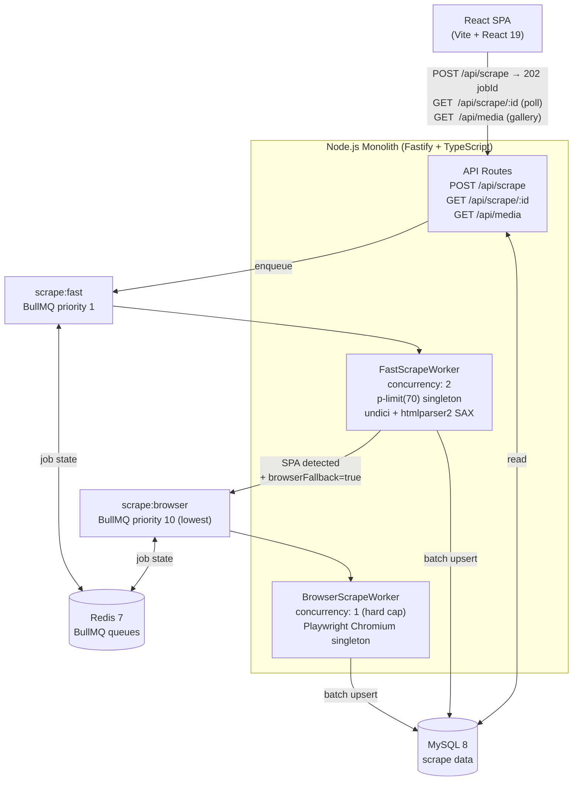
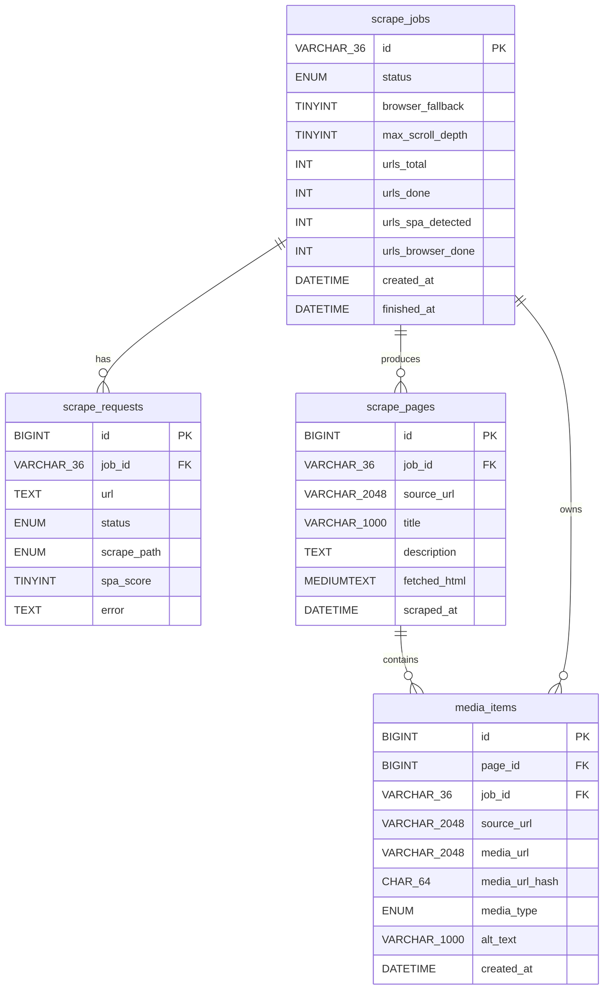

# Media Scraper

Async web scraper that extracts images and videos from URLs at scale. Handles 500 concurrent API clients on 1 CPU / 1 GB RAM via a two-queue BullMQ pipeline with optional Playwright SPA fallback.

---

## Quick Start

```bash
cp .env.example .env
docker compose up --build
```

Open http://localhost in browser.

## Development

```bash
npm install
npm run dev -w packages/api    # API on :3001
npm run dev -w packages/web    # Web on :5173
```

Database:
```bash
npm run db:migrate -w packages/api
npm run db:studio -w packages/api
```

---

## High-Level Architecture



### Two-Queue Pipeline

All URLs enter the **fast queue** (priority 1) first. The `FastScrapeWorker` fetches each URL with `undici`, streams the response through an `htmlparser2` SAX parser, and collects `` / `<video>` media plus SPA detection signals — all in a single pass.

If a page scores as a SPA **and** `browserFallback: true` was requested, the URL is re-queued to the **browser queue** (priority 10 = lowest). BullMQ only processes browser jobs when the fast queue is empty, so Playwright never competes with the fast path for RAM.

```
pending → running → fast_complete → done
                  ↘ done (no SPAs detected)

fast_complete: fast queue finished, browser queue still active
```

### Memory Budget (1 CPU / 1 GB RAM)

| Service | RAM |
|---------|-----|
| OS | ~100 MB |
| MySQL 8 (`innodb_buffer_pool_size=256M`) | ~256 MB |
| Redis 7 | ~40 MB |
| Node.js fast-path peak | ~480 MB |
| Playwright (only when browser queue has work) | ~300 MB |

Fast and browser peaks don't overlap — BullMQ priority ensures the browser worker only starts after fast jobs drain.

---

## Database Schema



**Deduplication:** `media_items.media_url_hash` is a SHA-256 of the media URL. Inserts use `ON DUPLICATE KEY UPDATE` — the same image scraped from multiple jobs produces exactly one row.

**Search:** `alt_text` and `source_url` are matched with `LIKE %term%` substring search. No extra search service required for MVP scale.

---

## API Contract

### `POST /api/scrape` — Submit a scrape job

```
Body:
{
  "urls": ["https://example.com", ...],   // 1–5000 items
  "options": {
    "browserFallback": false,             // re-queue SPAs to Playwright worker
    "maxScrollDepth": 10                  // browser path only; scroll steps (1–60)
  }
}

202 → { "jobId": "uuid-v4" }
400 → { "error": "urls must be a non-empty array of max 5000 items" }
429 → { "error": "rate_limit_exceeded", "retryAfter": 60 }
503 → { "error": "queue_full", "retryAfter": 30 }
```

### `GET /api/scrape/:jobId` — Poll job status

```
200 → {
  "id": "uuid-v4",
  "status": "fast_complete",     // pending | running | fast_complete | done | failed
  "browserFallback": true,
  "urlsTotal": 500,
  "urlsDone": 310,               // fast-path completed
  "urlsSpaDetected": 42,         // re-queued to browser path
  "urlsBrowserDone": 12,         // completed via Playwright
  "urlsBrowserPending": 30,      // still queued
  "createdAt": "2026-03-14T10:00:00.000Z",
  "finishedAt": null
}
```

### `GET /api/media` — List scraped media (paginated)

```
Query: page, limit (max 100), type (image|video), search, jobId

200 → {
  "data": [
    {
      "id": 1,
      "jobId": "uuid",
      "sourceUrl": "https://example.com",
      "mediaUrl": "https://example.com/img/hero.jpg",
      "mediaType": "image",
      "altText": "Hero image",
      "createdAt": "2026-03-14T10:01:00.000Z"
    }
  ],
  "pagination": { "page": 1, "limit": 20, "total": 4823, "totalPages": 242 }
}
```

### `GET /api/media/:id` — Single media item

```
200 → MediaItem
404 → { "error": "Not found" }
```

---

## Tech Stack

### Backend

| Layer | Technology | Notes |
|-------|-----------|-------|
| Runtime | Node.js 22 LTS | Pointer compression on by default |
| Language | TypeScript 5 strict | `strict: true`, no `any` |
| Framework | Fastify 5 | Schema-based validation; 2–3× faster than Express |
| Job Queue | BullMQ 5 | Redis-backed; persistent; retryable |
| HTTP Client | undici | 3–5× faster than axios; native connection pooling |
| HTML Parser | htmlparser2 (SAX) | Streaming; lowest memory; runs on main thread |
| SPA Browser | Playwright Chromium | Singleton instance; concurrency 1 |
| ORM | Prisma | TypeScript-first; auto-generated types |
| DB | MySQL 8 | Required |
| Cache / Queue | Redis 7 | BullMQ + rate-limit counters |
| Rate Limiting | @fastify/rate-limit | Redis-backed; configurable via env vars |

### Frontend

| Layer | Technology |
|-------|-----------|
| Build | Vite 6 |
| Framework | React 19 |
| Data Fetching | TanStack Query v5 |
| Styling | Tailwind CSS 3 + shadcn/ui |
| Notifications | Sonner |

### Infrastructure

| Tool | Use |
|------|-----|
| Docker Compose | Full-stack orchestration |
| k6 | Load testing |

---

## Key Design Decisions

### Scraping Pipeline

| Decision | Choice | Why |
|----------|--------|-----|
| API style | Async job-based | Scraping 500+ URLs takes 15–35 s; sync HTTP would timeout |
| HTTP client | undici | 3–5× faster than axios; native connection pool; required for p-limit(70) throughput |
| HTML parser | htmlparser2 SAX, main thread | Event-driven streaming — never buffers DOM; callbacks are µs so worker threads add overhead with zero benefit |
| Concurrency limiter | `p-limit(70)` **global process singleton** | `FastScrapeWorker` runs 2 BullMQ jobs in parallel; a per-job limiter would allow 140 concurrent requests. One singleton shared across all jobs enforces the real cap |
| Response size cap | 5 MB | Content-Length header fast-path + streaming byte-counter Transform; `body.dump()` immediately on non-200 to return socket to pool |
| Batch DB writes | 500 rows / 5 s flush | One-by-one inserts at p-limit(70) throughput would saturate MySQL |
| SPA detection | Score-based heuristic from SAX signals | Reuses data already collected during the fast pass — zero extra HTTP round-trip |
| SPA re-queue rule | Skip if `mediaCount > 0` | If the page served media, it's SSR/hybrid — no need for browser rendering |

### Queue & Concurrency

| Decision | Choice | Why |
|----------|--------|-----|
| Two queues | `scrape:fast` (priority 1) + `scrape:browser` (priority 10) | Browser jobs only run when fast queue is empty; Playwright never competes with the fast path |
| Browser worker concurrency | **Hard cap: 1** | Only one Chromium instance fits in the 1 GB budget alongside MySQL + Redis + fast scraper |
| Playwright singleton | One browser, N pages | Launching per-URL costs 300 MB each; singleton keeps overhead ~300 MB total |
| `page.close()` strategy | Called in `finally` after every URL | Releases Chromium tab memory; **never** call `browser.close()` in the hot path |
| `waitUntil` strategy | `domcontentloaded` + `waitForTimeout(1000)` + `autoScroll()` | `networkidle` hangs forever on SPAs with continuous API polling |

### Reliability & Status

| Decision | Choice | Why |
|----------|--------|-----|
| Job status transitions | Atomic `UPDATE ... SET status = CASE ... END WHERE` | Single SQL statement — no SELECT + UPDATE race condition |
| `fast_complete` status | Intermediate state between fast-done and browser-done | Enables two-phase progress UI; client knows fast path finished but browser path is still active |
| Watchdog | SQL `UPDATE` every 5 min reaping jobs stuck > 30 min | Handles crashed workers; no BullMQ event required |
| Media loss on crash | Acceptable | Simplifies processor — no transactional batch flush needed; explicitly documented |

---

## Load Test

Requires [k6](https://k6.io/docs/get-started/installation/):

```bash
# Start the stack first
docker compose up

# Default — 500 VUs, countries.csv (Wikipedia)
k6 run --env API_BASE=http://localhost:3001 load-test/k6-scrape.js

# JS package landing pages
k6 run --env API_BASE=http://localhost:3001 \
       --env CSV_FILE=./js-packages.csv \
       load-test/k6-scrape.js

# Tune batch size
k6 run --env URLS_PER_JOB=10 load-test/k6-scrape.js
```

Monitor RAM during test:
```bash
docker stats
```

Thresholds:
- `POST /api/scrape` p95 < 500 ms under 500 concurrent clients
- Error rate < 0.5 %
- All jobs reach terminal status within 120 s
- Node.js container peak RAM < 580 MB

---

## SPA Smoke Test

```bash
curl -X POST http://localhost:3001/api/scrape \
  -H 'Content-Type: application/json' \
  -d '{"urls":["https://react.dev","https://vuejs.org","https://angular.dev"],"options":{"browserFallback":true}}'
```

Poll `GET /api/scrape/{jobId}` and verify `urlsSpaDetected: 3`.

---

See [docs/technical-design.md](docs/technical-design.md) for the full architecture document.
